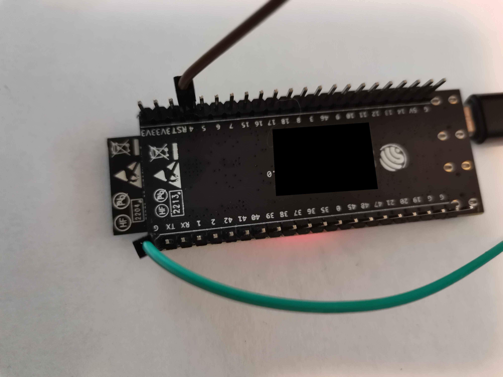

.. image:: https://shields.microej.com/endpoint?url=https://repository.microej.com/packages/badges/sdk_5.6.json
   :alt: sdk_5.6 badge
   :align: left

.. image:: https://shields.microej.com/endpoint?url=https://repository.microej.com/packages/badges/arch_7.18.json
   :alt: arch_7.18 badge
   :align: left
..
    Copyright 2022-2023 MicroEJ Corp. All rights reserved.
    Use of this source code is governed by a BSD-style license that can be found with this software.

.. |BOARD_NAME| replace:: ESP32-S3-DevKitC-1-N8R8
.. |BOARD_REVISION| replace:: 1.0
.. |RCP| replace:: MICROEJ SDK
.. |VEEPORT| replace:: VEE Port
.. |SIM| replace:: Simulator
.. |CIDE| replace:: MICROEJ SDK
.. |RTOS| replace:: FreeRTOS RTOS
.. |MANUFACTURER| replace:: Espressif
.. |BSP_FULL_NAME| replace:: Espressif IoT Development Framework 
.. |BSP_SHORT_NAME| replace:: ESP-IDF

.. _中文版: ./docs/zn_CH/README_CN.rst
.. _README BSP: ./ESP32-S3-DevKitC1-Xtensa-FreeRTOS-bsp/projects/microej/README.rst
.. _RELEASE NOTES: ./RELEASE_NOTES.rst
.. _CHANGELOG: ./CHANGELOG.rst

==========================================
|VEEPORT| for |MANUFACTURER| |BOARD_NAME|
==========================================

`中文版`_

This project is used to build a |VEEPORT| for the |BOARD_NAME|
development board.

.. image:: ./images/ESP32-S3-DevKitC1.jpg

Clone the repository with the following command:

.. code-block:: sh

   git clone --recursive https://github.com/MicroEJ/Platform-Espressif-ESP32-S3-DevKitC-1-N8R8

Do not miss the ``--recursive`` option. If you have already cloned this project without this option, run another command to get all the submodules:

.. code-block:: sh

   git submodule update --init --recursive

Related Files
=============

This directory also contains:

* `CHANGELOG`_ to track the changes in the |VEEPORT| for |BOARD_NAME| 
* `RELEASE NOTES`_ to list:

  - the supported hardware,
  - the known issues and the limitations,
  - the development environment,
  - the list of the dependencies and their versions.

* `README BSP`_ recommended for users familiar with the
  |MANUFACTURER| SDK/BSP and advanced usage on how to customize the build
  process.

Board Technical Specifications
==============================

.. list-table::

   * - Name
     - |BOARD_NAME|
   * - Revision
     - |BOARD_REVISION|
   * - MCU part number
     - ESP32-S3-WROOM-1/1U
   * - MCU revision
     - N/A
   * - MCU architecture
     - Xtensa LX7
   * - MCU max clock frequency
     - 240 MHz
   * - Internal ROM size
     - 384 KB
   * - Internal RAM size
     - 512 KB
   * - External flash size
     - 8 MB
   * - External RAM size
     - 8 MB 
   * - Power supply
     - USB, External 5V

Here is a list of |BOARD_NAME| useful documentation links:

- Board documentation available `here <https://docs.espressif.com/projects/esp-idf/en/v5.0/esp32s3/hw-reference/esp32s3/user-guide-devkitc-1.html#hardware-reference>`__
- |MANUFACTURER| board Getting Started available `here <https://docs.espressif.com/projects/esp-idf/en/v5.0/esp32s3/get-started/index.html#introduction>`__
- Board schematics available `here <https://dl.espressif.com/dl/SCH_ESP32-S3-DEVKITC-1_V1_20210312C.pdf>`__
- MCU Technical Reference Manual available `here <https://www.espressif.com/sites/default/files/documentation/esp32-s3_technical_reference_manual_en.pdf>`__
- MCU Datasheet available `here <https://www.espressif.com/sites/default/files/documentation/esp32-s3_datasheet_en.pdf>`__

|VEEPORT| Specifications
=======================

The Architecture version is ``7.18.1``.

This |VEEPORT| provides the following Foundation Libraries:

.. list-table::
   :header-rows: 1

   * - Foundation Library
     - Version
   * - BLUETOOTH
     - 2.1
   * - BON
     - 1.4
   * - DEVICE
     - 1.1
   * - ECOM-NETWORK
     - 2.1
   * - ECOM-WIFI
     - 2.3
   * - ESP_IDF
     - 1.1
   * - FS
     - 2.1
   * - HAL
     - 1.0
   * - KF
     - 1.6
   * - NET
     - 1.1
   * - NLS
     - 2.0 
   * - SECURITY
     - 1.4
   * - SNI
     - 1.4
   * - SSL
     - 2.2
   * - TRACE
     - 1.1
   * - WATCHDOG
     - 1.0 

The |VEEPORT| is derived into:

- a Mono-Sandbox |VEEPORT| (default)
- a Multi-Sandbox |VEEPORT|

Requirements
============

- PC with Windows 10 or Linux (tested with Ubuntu LTS 20.04)
- Internet connection to `MicroEJ Central Repository <https://developer.microej.com/central-repository/>`_
- |RCP| Dist. ``21.11`` or higher, available `here <https://developer.microej.com/microej-sdk-software-development-kit/>`_
- |BOARD_NAME| board

BSP Setup
=========

Install the |MANUFACTURER| toolchain by following the section ``Manual Installation`` described `here
<https://docs.espressif.com/projects/esp-idf/en/v5.0/esp32s3/get-started/index.html#installation-step-by-step>`__. Use the ``Universal online installer`` and configure it to use an existing |BSP_FULL_NAME| (|BSP_SHORT_NAME|)
directory and point it to ``ESP32-S3-DevKitC1-Xtensa-FreeRTOS-bsp/sdk/esp-idf``.

Please pay attention on the limitations regarding the installation path (e.g. no white spaces, parentheses ...), 
described in the above documentation.

Please refer to the |MANUFACTURER| documentation available `here <https://docs.espressif.com/projects/esp-idf/en/v5.0/esp32s3/api-guides/tools/idf-tools.html#list-of-idf-tools>`__
for more details about |MANUFACTURER| tools.

Windows Toolchain
-----------------

- C/C++ toolchain name: xtensa-esp32s3-elf-gcc
- C/C++ toolchain version: 11.2.0 (crosstool-NG esp-2022r1)
- C/C++ toolchain download link for 64-bit Windows: https://github.com/espressif/crosstool-NG/releases/download/esp-2022r1/xtensa-esp32s3-elf-gcc11_2_0-esp-2022r1-win64.zip
- C/C++ toolchain download link for 32-bit Windows: https://github.com/espressif/crosstool-NG/releases/download/esp-2022r1/xtensa-esp32s3-elf-gcc11_2_0-esp-2022r1-win32.zip

Please refer to the |MANUFACTURER| documentation available `here
<https://docs.espressif.com/projects/esp-idf/en/v5.0/esp32s3/get-started/windows-setup.html>`__
for more details.

Linux Toolchain
---------------

- C/C++ toolchain name: xtensa-esp32s3-elf-gcc
- C/C++ toolchain version: 11.2.0 (crosstool-NG esp-2022r1)
- C/C++ toolchain download link for 64-bit Linux: https://github.com/espressif/crosstool-NG/releases/download/esp-2022r1/xtensa-esp32s3-elf-gcc11_2_0-esp-2022r1-linux-amd64.tar.xz
- C/C++ toolchain download link for 32-bit Linux: https://github.com/espressif/crosstool-NG/releases/download/esp-2022r1/xtensa-esp32s3-elf-gcc11_2_0-esp-2022r1-linux-i686.tar.xz

Please refer to the |MANUFACTURER| documentation available `here
<https://docs.espressif.com/projects/esp-idf/en/v5.0/esp32s3/get-started/linux-macos-setup.html>`__
for more details.

BSP Compilation
---------------

Before the first build of the BSP, ensure you have cloned the repository and all its submodules
and also the patch for the MicroEJ Segger SystemView implementation is applied. This can be done
running the script ``RunAtFirstBSPCompile.*`` located in  ``xxx/ESP32-S3-DevKitC1-Xtensa-FreeRTOS-bsp/projects/microej/scripts``.
Please refer to the `README BSP`_ for further details.

The |VEEPORT| provides a pre-compiled Mono-Sandbox Application.
Validate the BSP installation by compiling the BSP to build a |BOARD_NAME|
Firmware.

To build the ``ESP32-S3-DevKitC1-Xtensa-FreeRTOS-bsp`` project, open a
terminal and enter the following command lines:

**On Windows:**

.. code-block:: sh

      $ cd "xxx/ESP32-S3-DevKitC1-Xtensa-FreeRTOS-bsp/projects/microej/scripts"
      $ build.bat 

**On Linux / macOS:**

.. code-block:: sh

      $ cd "xxx/ESP32-S3-DevKitC1-Xtensa-FreeRTOS-bsp/projects/microej/scripts"
      $ build.sh 

The BSP project build is launched. Please wait for the final message:

.. code-block::

      Project build complete. To flash, run this command:

Please refer to `README BSP`_ for more details on how to
customize the build scripts.

Board Setup
===========

Please refer to the |MANUFACTURER| documentation available `here
<https://docs.espressif.com/projects/esp-idf/en/v5.0/esp32s3/hw-reference/esp32s3/user-guide-devkitc-1.html>`__
for more details.

Power Supply
------------

The board can be powered by USB cable or external 5V power supply.

Please refer to the |MANUFACTURER| documentation available `here
<https://docs.espressif.com/projects/esp-idf/en/v5.0/esp32s3/hw-reference/esp32s3/user-guide-devkitc-1.html#getting-started>`__
for more details.

Programming
-----------

The |BOARD_NAME| board can be flashed using |MANUFACTURER|
bootloader. Please Follow the steps below:

- Connect the USB connector of the board labelled UART to your computer
- Find the new COM port available
- Create the ``ESP32-S3-DevKitC1-Xtensa-FreeRTOS-bsp/projects/microej/scripts/set_local_env.xxx`` script
  by copying the template ``ESP32-S3-DevKitC1-Xtensa-FreeRTOS-bsp/projects/microej/scripts/set_local_env.xxx.tpl``
  (where ``xxx`` is ``bat`` for Windows and ``sh`` for Linux / macOS).
- Update the ``ESPPORT`` variable in the script to put the COM port discovered previously.
- Open a terminal and enter the following command lines:

**On Windows:**

.. code-block:: sh

      $ cd "xxx/ESP32-S3-DevKitC1-Xtensa-FreeRTOS-bsp/projects/microej/scripts"
      $ run.bat 

**On Linux / macOS:**

.. code-block:: sh

      $ cd "xxx/ESP32-S3-DevKitC1-Xtensa-FreeRTOS-bsp/projects/microej/scripts"
      $ run.sh 

The firmware is launched. Please wait for the final message:

.. code-block::

    Leaving...
    Hard resetting via RTS pin...
    Done

|MANUFACTURER| build and flash documentation are also available `here
<https://docs.espressif.com/projects/esp-idf/en/v5.0/esp32s3/get-started/index.html#step-8-build-the-project>`__
for more details.

Logs Output
-----------

This |VEEPORT| uses the virtual UART from the |BOARD_NAME|
USB port. A COM port is automatically mounted when the board is
plugged to a computer using USB cable.  All board logs are available
through this COM port.

The COM port uses the following parameters:

.. list-table::
   :widths: 3 2

   * - Baudrate
     - 115200
   * - Data bits bits
     - 8
   * - Parity bits
     - None
   * - Stop bits
     - 1
   * - Flow control
     - None

If flashed, the pre-compiled application outputs ``Hello World`` on
the UART.

When running a Testsuite, logs must be redirected to a secondary UART
port.  Please refer to `Test Suite Configuration`_ for a detailed
explanation.

Please refer to the |MANUFACTURER| documentation available `here
<https://docs.espressif.com/projects/esp-idf/en/v5.0/esp32s3/get-started/establish-serial-connection.html#>`__
for more details.

Debugging
---------

A JTAG interface is also directly available through the USB interface.

Please refer to the `README BSP`_ section debugging for more
details.

|VEEPORT| Setup
==============

|VEEPORT| Import
---------------

Import the projects in |RCP| Workspace:

- ``File`` > ``Import`` > ``Existing Projects into Workspace`` >
  ``Next``
- Point ``Select root directory`` to where the project was cloned.
- Click ``Finish``

Inside |RCP|, the selected example is imported as several projects
prefixed by the given name:

- ``ESP32-S3-DevKitC1-Xtensa-FreeRTOS-configuration``: Contains the
  |VEEPORT| configuration description. Some modules are described in a
  specific sub-folder / with some optional configuration files
  (``.properties`` and / or ``.xml``).

- ``ESP32-S3-DevKitC1-Xtensa-FreeRTOS-bsp``: Contains a ready-to-use BSP
  software project for the |BOARD_NAME| board, including a
  |CIDE| project, an implementation of MicroEJ core engine (and
  extensions) port on |RTOS| and the |BOARD_NAME| board
  support package.

- ``ESP32-S3-DevKitC1-Xtensa-FreeRTOS-fp``: Contains the board description
  and images for the |SIM|. This project is updated once the |VEEPORT|
  is built.

- ``ESP32S3DevKitC1-Platform-GNUv82_xtensa-esp32s2-{version}``:
  Contains the |RCP| |VEEPORT| project which is empty by default until
  the |VEEPORT| is built.

By default, the |VEEPORT| is configured as a Mono-Sandbox Evaluation
|VEEPORT|.  If the |VEEPORT| is configured as Multi-Sandbox, use the
``build_no_ota_no_systemview`` script (Please refer to the `RELEASE
NOTES`_ limitations section for more details).

|VEEPORT| Build
--------------

To build the |VEEPORT|, please follow the steps below:

- Right-click on ``ESP32-S3-DevKitC1-Xtensa-FreeRTOS-configuration``
  project in your |RCP| workspace.
- Click on ``Build Module``

The build starts.  This step may take several minutes.  The first
time, the |VEEPORT| build requires to download modules that are
available on the MicroEJ Central Repository.  You can see the progress
of the build steps in the |RCP| console.

Please wait for the final message:

.. code-block::

                          BUILD SUCCESSFUL

At the end of the execution the |VEEPORT| is fully built for the
|BOARD_NAME| board and is ready to be used.

The |VEEPORT| project should be refreshed with no error in the |RCP|
``ESP32S3DevKitC1-Platform-GNUv82_xtensa-esp32s2-{version}``.

Please refer to
https://docs.microej.com/en/latest/ApplicationDeveloperGuide/standaloneApplication.html
for more information on how to build a MicroEJ Standalone Application.

An evaluation license is needed for building an application. Please refer to
https://docs.microej.com/en/latest/overview/licenses.html#evaluation-license
for information on how to acquire and activate a license.

Test Suite Configuration
========================

To run a Test Suite on the |BOARD_NAME| board the standard output must
be redirected to a dedicated UART.  The property
``microej.testsuite.properties.debug.traces.uart`` must be set in the
``config.properties`` of the Test Suite.

This property redirects the UART onto a different GPIO port. Connect a
FTDI USB wire to the pin D4 of the J1 connector and ground.

In ``config.properties``, the property ``target.platform.dir`` must be
set to the absolute path to the VEE port. For example
``C:/ESP32S3DevKitC1-Platform-GNUv82_xtensa-esp32s2-{version}/source``.

Troubleshooting
===============

Unable to flash on Linux through VirtualBox
-------------------------------------------

Press the "boot" button on the board while flashing.

Files not found during the build
--------------------------------

Errors about files not found during the build may be caused by long
path.  Please refer to the known issues and limitations in the
`RELEASE NOTES`_ for a workaround.
